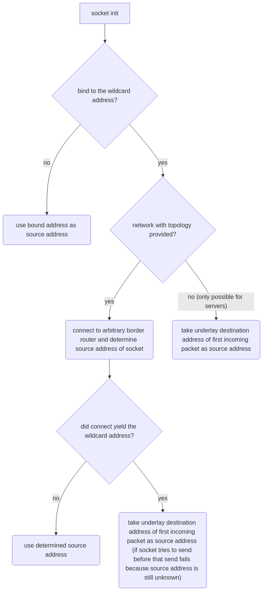

# Source Address Determination

In SCION the source address of a sending host needs to be known in order to be able to send a packet. The easiest way to
achieve this is to explicitly bind a socket to an address other than the wildcard address with `scion_bind()`. The
**wildcard address** is the IPv4 address `0.0.0.0` or the IPv6 address `::`.

In cases where a socket is implicitly or explicitly bound to the wildcard address the library tries automatically
determine the
source address with different methods. This automatic source address determination makes the following assumption:
> in the network (AS) all communication partners (hosts and border routers) can reach the host running CSNET with **one
> and the same** address

The source address of a socket is determined as follows:

Note that it is possible for the automatic source address determination to fail (sending will result with a
`SCION_SRC_ADDR_UNKNOWN` error). In such cases, a non-wildcard address has to be bound explicitly.